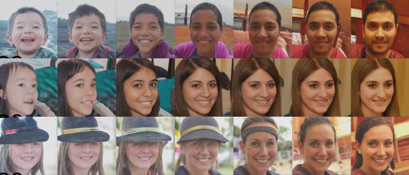
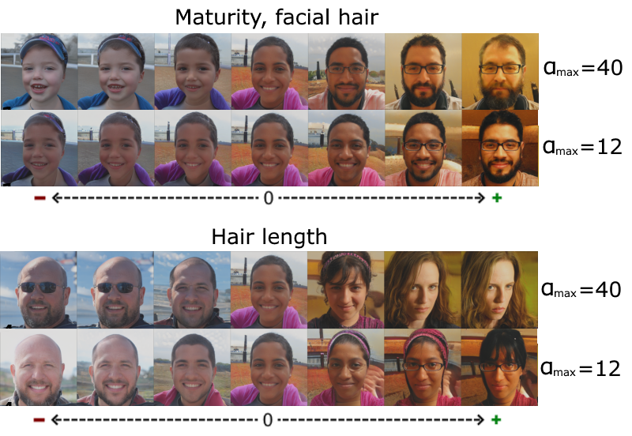

# ganlatent: GAN Latent Space Discovery

## Discover interpretable trajectories inside GAN's latent space using different algorithms

Generative-Adversarial Networks (GANs) are capable of creating realistic images with high fidelity and diversity. An extensive latent space emerges as a result of GAN training, which contains a lot of interpretable trajectories, allowing to semantically edit the image by traversing along them.
This repository contains code for launching different unsupervised methods that discover latent space: [linear model](https://github.com/anvoynov/GANLatentDiscovery) by Voynov et al., [WarpedGANSpace](https://github.com/chi0tzp/WarpedGANSpace) and our new proposed models: Model FC-A and Model FC-B.

### Installation and Running

```
python3 -m pip install -r requirements.txt
python3 utils_common/download.py --out weights                        # This will download models' wieghts
mv weights/pretrained/generators weights/generators
python3 main.py exp.config=base_config.yaml exp.config_dir=configs    # Configure runs using files in config/ folder
```

### Gallery



Latent trajectories are input-agnostic.



Image generation of model FC-A is controlled by a scale hyperparameter.

### TODO

- Release Paper
- Make config files less complicated
- Move constants from code to config files 

### Credits

This repository uses code by [Voynov et al.](https://github.com/anvoynov/GANLatentDiscovery) and [Tzelepis et al.](https://github.com/chi0tzp/WarpedGANSpace)
